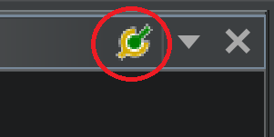

# Connecting Ghidra to PCSX-Redux

Since version 10.3, Ghidra now supports debugging MIPS targets. This allows for a much more powerful reverse engineering experience than what was previously possible with the GDB server. This document will explain how to set up Ghidra to debug PCSX-Redux, as it is not entirely straightforward.

## Prerequisites

- A gdb "multiarch" binary is required. For Windows, you can get it from [here](https://static.grumpycoder.net/pixel/gdb-multiarch-windows/). For Linux, you can get it from your distribution's package manager; on Ubuntu and Debian, this is the package `gdb-multiarch`. And for MacOS, you can use the [brew package manager](https://brew.sh/) to install it; this is the package `gdb`.
- Ghidra 10.3 or newer. You can get it from [here](https://ghidra-sre.org/).
- PCSX-Redux either configured to disable Dynarec, enable the debugger, and enable the gdb server, or started using the following command-line arguments: `-interpreter -debugger -gdb`.
- The [following file](https://raw.githubusercontent.com/grumpycoders/pcsx-redux/main/tools/ghidra_scripts/ghidra_debugger_scripts) downloaded somewhere on your computer.

## Setting up Ghidra

Before starting Ghidra, until version 10.3.3, the MIPS CPU isn't terribly well defined. One needs to go to the installation files of Ghidra, and edit the file `Ghidra/Processors/MIPS/data/languages/mips.ldef`. In this file, find the lines `<external_name tool="gnu" name="mips:4000"/>`, and change them to `<external_name tool="gnu" name="mips:3000"/>`. This will allow Ghidra to properly recognize the MIPS CPU used by the PlayStation 1. This step is no longer necessary starting with Ghidra 10.3.3.

## Setting up Ghidra's debugger

When in the main view of Ghidra, right click on the project you want to debug, and in the context menu, select `Open With > Debugger`. This will open the debugger tool instead of the default disassembler tool.

First, identify the Debugger Targets window, and click its top right button:  

This will open the debugger connector window. In the drop down, select `gdb`, and as the launch command, enter the path to the gdb multiarch binary, followed by `-i mi2`. For example, on Windows, this could be `C:/gdb-multiarch/bin/gdb-multiarch.exe -i mi2`. Click `Connect`.

A new `Interpreter` window should open on the right, with the prompt `(gdb)` allowing you to type commands. First, you need to source the `ghidra_debugger_scripts` file from before. To do this, type `source <path to ghidra_debugger_scripts>`. For example, on Windows, this could be `source C:/Users/Pixel/Downloads/ghidra_debugger_scripts`. Then, you need to connect to the PCSX-Redux gdb server. To do this, type `target remote localhost:3333`. Finally, locate the `Modules` tab in the right window, next to the `Interpreter` tab, which should look like this:  

Select the top line, right click on it, and in the context menu, select `Map Module to <name of your project>`. In the new window that appears, simply click `Ok`.

At this point, Ghidra should be fully connected to PCSX-Redux, and should be able to place breakpoint, resume or pause execution, inspect variables, etc. Please be aware that, as of Ghidra 10.3, many features of the debugger are still work in progress, and won't necessarily be stable.
