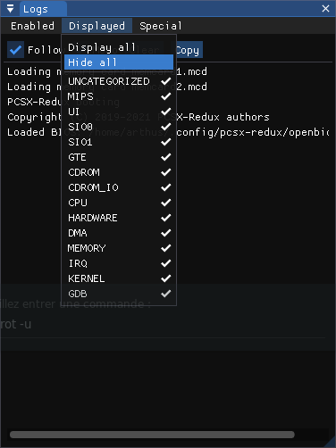

# Advanced Features

## Mapping breakpoints

PCSX-Redux has a feature that allows mapping the memory of the console while the software is running, and to set breakpoints on the mapped memory. This can for instance help in finding codepath when performing certain activities in the when running code.

First, map the kind of action you want to discover, such as executing code, reading memory, or writing memory. Then, run the code for some time without performing the specific action you want to discover. Finally, activate the map breakpoint mode, and then perform the action you want to discover. The breakpoint should be triggered when the action is performed.

For example, say that in a game, you want to know what code is executed when you press the "X" button. First, check the `Map execution` checkbox. Then, run the game for a while without pressing the "X" button. This will map enough of the memory that's being run in a normal way. Finally, activate the `Break on execution map` checkbox, and press the "X" button. If the game takes a new codepath that hasn't been executed yet, the breakpoint should be triggered.

Breakpoints are always checked before mapping the memory, so it's safe to keep both checkboxes on at the same time.

Click the `Clear maps` button to zero out all of the maps, when starting anew.

## CPU trace dump

### Setup

In PCSX-Redux, make sure `Debug > Show logs` is enabled.

In the 'Logs' window, hide all logs : `Displayed > Hide all`

To avoid unnecessary noise, you can also skip ISR during CPU traces : `Special > Skip ISR during CPU traces`




### Begin dump

To dump the CPU traces, launch pcsx-redux with the following command :

```bash
pcsx-redux -stdout -logfile log.txt
# Alternatively, you can use -stdout on its own and pipe the output to a file.
pcsx-redux -stdout >> log.txt
```

You can use [additional flags](./cli_flags.md) to launch an executable/disk image in one go, e.g :

```bash
pcsx-redux -stdout -logfile tst.log -iso image.cue -run
```

### Source 

[https://discord.com/channels/642647820683444236/663664210525290507/882608398993063997](https://discord.com/channels/642647820683444236/663664210525290507/882608398993063997)
