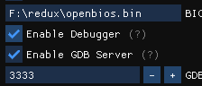

# GDB server 

The GDB server allows you to set breakpoints  and control your PSX program's execution from your gdb compatible IDE.

## Enabling the GDB server

  

In PCSX-Redux:  `Configuration > Emulation > Enable GDB server`.   

Make sure the debugger is also enabled.  

  

## GDB setup

You need `gdb-multiarch` on your system :

### Windows

Download a pre-compiled version from here : [https://static.grumpycoder.net/pixel/gdb-multiarch-windows/](https://static.grumpycoder.net/pixel/gdb-multiarch-windows/)

### GNU/Linux

Install via your package manager :

```bash
# Debian derivative; Ubuntu, Mint...
sudo apt install gdb-multiarch
# Arch derivative; Manjaro
# 'gdb-multiarch' is available in aur : https://aur.archlinux.org/packages/gdb-multiarch/
sudo trizen -S gdb-multiarch
```

## IDE setup

### MS VScode

  * Install the `Native debug`  extension :  
  [https://marketplace.visualstudio.com/items?itemName=webfreak.debug](https://marketplace.visualstudio.com/items?itemName=webfreak.debug)

  

  * Adapt your `launch.json` file to your environment :  
  A sample `lanuch.json` file is available [here](https://github.com/grumpycoders/pcsx-redux/blob/main/.vscode/launch.json).  
  This should go in `your-project/.vscode/`.  
  
  You need to adapt the values of `"executable"`, `"gdbpath"` and `"autorun"` according to your system :
  
#### executable

  This is the path to your `.elf` executable :  
```json
   "executable": "HelloWorld.elf",
```
  [https://github.com/grumpycoders/pcsx-redux/blob/a3bebd490388130e924124cdfeff3bc46b6149d9/.vscode/launch.json#L153](https://github.com/grumpycoders/pcsx-redux/blob/a3bebd490388130e924124cdfeff3bc46b6149d9/.vscode/launch.json#L153) 

#### gdbpath

  This the path to the `gdb-multiarch` executable:  
```json
   "gdbpath": "/usr/bin/gdb-multiarch",
```
  [https://github.com/grumpycoders/pcsx-redux/blob/a3bebd490388130e924124cdfeff3bc46b6149d9/.vscode/launch.json#L154-L157](https://github.com/grumpycoders/pcsx-redux/blob/a3bebd490388130e924124cdfeff3bc46b6149d9/.vscode/launch.json#L154-L157)

#### autorun

```json
   "autorun": [
    "monitor reset shellhalt",
    [...]
    "load your-file.elf",
```

  Make sure that `"load your-file.elf"` corresponds to the `"target"` value.  
  
  [https://github.com/grumpycoders/pcsx-redux/blob/a3bebd490388130e924124cdfeff3bc46b6149d9/.vscode/launch.json#L159-L165](https://github.com/grumpycoders/pcsx-redux/blob/a3bebd490388130e924124cdfeff3bc46b6149d9/.vscode/launch.json#L159-L165)
  
  By default, using `localhost` should work, but if encountering trouble, try using your computer's local IP (e.g; 192.168.x.x, 10.0.x.x, etc.)

  [https://github.com/grumpycoders/pcsx-redux/blob/a3bebd490388130e924124cdfeff3bc46b6149d9/.vscode/launch.json#L150](https://github.com/grumpycoders/pcsx-redux/blob/a3bebd490388130e924124cdfeff3bc46b6149d9/.vscode/launch.json#L150)


### Geany

Make sure you installed the [official plugins](https://www.geany.org/download/releases/#geany-plugins-releases) and enable the `Scope debugger`.

To enable the plugin, open Geany, go to `Tools > Plugin manager` and enable `Scope Debugger`.

You can find the debugging facilities  in the `Debug` menu ;


You can find the plugin's documentation here : [https://plugins.geany.org/scope.html](https://plugins.geany.org/scope.html)

#### .gdbinit

Create a `.gdbinit` file at the root of your project with the following content, adapting the path to your `elf` file and the gdb server's ip.

```
target remote localhost:3333
symbol-file load /path/to/your/executable.elf
monitor reset shellhalt
load /path/to/your/executable.elf
```

#### Plugin configuration 

In Geany : `Debug > Setup Program` :  


## Beginning Debugging

Launch `pcsx-redux`, then run the debugger from your IDE. It should load the `elf` file, and execute until the next breakpoint.

### Starting debugging in Geany

<video width="640" height="360" controls>
  <source src="https://archive.org/download/pcsx_redux_geany_gdb/pcsx_redux_geany_gdb.webm" type="video/webm">
Your browser does not support the video tag.
</video>

Source :  
[https://archive.org/details/pcsx_redux_geany_gdb](https://archive.org/details/pcsx_redux_geany_gdb)


## Additional tools

[https://github.com/cyrus-and/gdb-dashboard/](https://github.com/cyrus-and/gdb-dashboard/)
