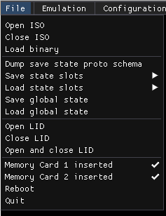
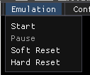

# Pcsx-redux menus

The menu bar holds some informations :

  * CPU mode
  * Game ID
  * ImGui FPS counter (not psx internal fps)

## File

  * Open ISO
  * Close ISO
  * Load Binary
  * Dump save state proto schema
  * Save state slots
  * Load state slots
  * Save global state
  * Load global state
  * Open Lid : Simulate open lid
  * Close Lid : Simulate closed lid
  * Open and Close Lid : Simulate open then closed lid
  * MC1 inserted
  * MC2 inserted
  * Reboot : Restart emulator
  * Quit

## Emulation

  * Start : Start execution
  * Pause : Pause execution
  * Soft reset : Calls Redux's CPU reset function, which jumps to the BIOS entrypoint (0xBFC00000), resets some COP0 registers and the general purpose registers, and resets some IO. Does not clear vram.
  * Hard reset : Similar to a reboot of the PSX.

## Configuration

  * Emulation : Emulation settings
  * GPU : graphical processor settings
  * SPU : Sound processor settings
  * UI : Change interface settings
  * Controls : Edit KB/Pad controls
  * Shader presets : Apply a shader preset
  * Configure shaders : show shader editor
## Debug

## Help

  * Show Imgui demo
  * About
