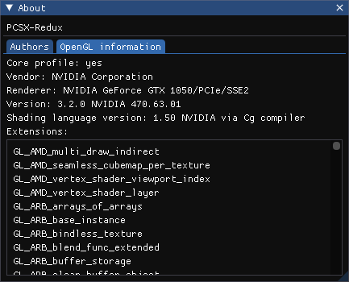

# PCSX-Redux menus

The menu bar holds some informations :

  * CPU mode
  * Game ID
  * ImGui FPS counter (not psx internal fps)

## File

  * Open ISO
  * Close ISO
  * Load Binary
  * Dump save state proto schema
  * Save state slots
  * Load state slots
  * Save global state
  * Load global state
  * Open Lid : Simulate open lid
  * Close Lid : Simulate closed lid
  * Open and Close Lid : Simulate opening then closing the lid
  * MC1 inserted: Insert or remove Memory Card 1
  * MC2 inserted: Insert or remove Memory Card 2
  * Reboot : Restart emulator
  * Quit

## Emulation

  * Start (F5): Start execution
  * Pause (F6): Pause execution
  * Soft reset (F8): Calls Redux's CPU reset function, which jumps to the BIOS entrypoint (0xBFC00000), resets some COP0 registers and the general purpose registers, and resets some IO. Does not clear vram.
  * Hard reset (Shift-F8): Similar to a reboot of the PSX.

## Configuration

  * Emulation : Emulation settings
  * GPU : Graphics Processing Unit settings
  * SPU : Sound Processing Unit settings
  * UI : Change user interface settings (such as font size, language or UI theme)
  * Controls : Edit KB/Pad controls
  * Shader presets : Apply a shader preset
  * Configure shaders : Show shader editor
## Debug

## Help

  * Show ImGui demo
  * About

## GPU information

The 'About' dialog available in the 'Help' menu has an 'OpenGL information' tab that displays information on the GPU currently used by the program, such as the supported OpenGL extensions.

