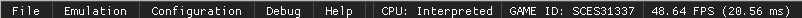
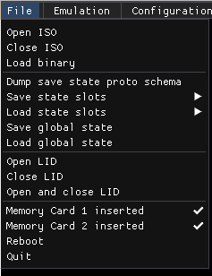
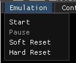
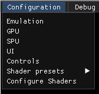
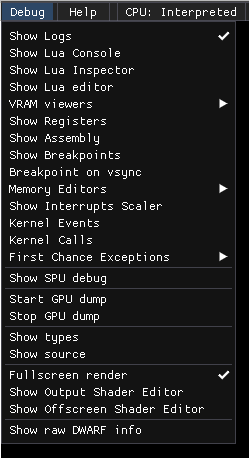
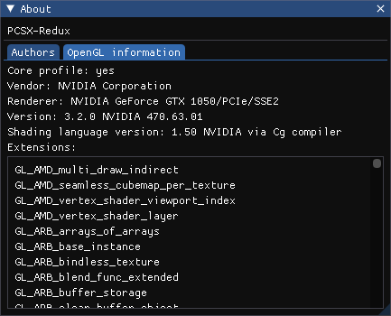

# PCSX-Redux menus

The menu bar holds some informations :

  * CPU mode
  * Game ID
  * ImGui FPS counter (not psx internal fps)
  * Guest FPS counter ("guest FPS") : how many times per second the emulated software moves its display start, which is how games flip buffers. Measured over one second of emulated vsyncs, 50 or 60 depending on the video setting. Reads 0 when the same buffer stays on screen, as with interlaced or single buffered games, and some pause screens.
  * Audio buffer size, in milliseconds and frames

The FPS counters and the audio buffer size are only shown while the emulation is running; otherwise the menu bar displays "Idle".

## File

  * Open Disk Image
  * Reload Disk Image : Reopen the current disk image and hard reset
  * Close Disk Image
  * Load binary
  * Add Lua archive
  * Dump save state proto schema
  * Save state slots
  * Save global state
  * Load state slots
  * Load global state
  * Open LID : Simulate open lid
  * Close LID : Simulate closed lid
  * Open and close LID : Simulate opening then closing the lid
  * Reset settings...
  * Reboot : Restart emulator
  * Quit

## Emulation

  * Start emulation (F5): Start execution
  * Pause emulation (F6): Pause execution
  * Soft Reset (F8): Calls Redux's CPU reset function, which jumps to the BIOS entrypoint (0xBFC00000), resets some COP0 registers and the general purpose registers, and resets some IO. Does not clear vram.
  * Hard Reset (Shift+F8): Similar to a reboot of the PSX.

## Configuration

  * Fullscreen
  * Full window render
  * Shader presets : Apply a shader preset
  * Configure Shaders : Show shader editor
  * Controls : Edit KB/Pad controls
  * Manage Memory Cards : Open the memory card manager
  * Emulation : Emulation settings
  * GPU : Graphics Processing Unit settings
  * SPU : Sound Processing Unit settings
  * PIO Cartridge : Parallel port cartridge settings
  * UI : Change user interface settings (such as font size, language or UI theme)
  * System : System settings

## Debug

  * Show Logs
  * Lua : Lua console, inspector and editor
  * CPU : Registers, assembly, breakpoints, callstacks, memory editors and other CPU debugging tools
  * GPU : VRAM viewers, GPU logger and GPU debug
  * SPU : SPU debug
  * CD-Rom : Iso browser and CD-ROM viewer
  * Misc hardware : Hardware registers and SIO1 debug
  * Show PSYQo heap viewer
  * Kernel : Kernel events, handlers and calls
  * Rendering : Output and offscreen shader editors, and shader reset

## Help

  * Show ImGui Demo
  * Show UvFile information
  * About

## GPU information

The 'About' dialog available in the 'Help' menu has an 'OpenGL information' tab that displays information on the GPU currently used by the program, such as the supported OpenGL extensions.

